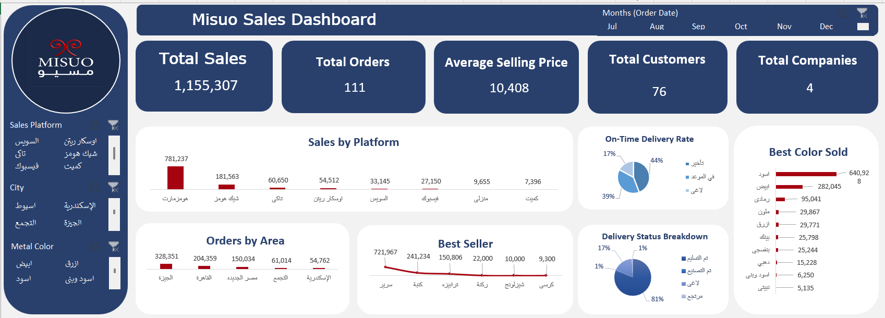

<h1 align="center">📊 Excel Dashboard Project</h1>

  Interactive Excel Dashboard for Data Analysis & Visualization

<h2>📌 Overview</h2>

This project presents an interactive Excel dashboard for data analysis and visualization.

<h2>🛠️ Tools Used</h2>

<ul>
  <li>📗 Microsoft Excel</li>
  <li>📊 Pivot Tables</li>
  <li>📈 Charts & Dashboard Design</li>
  <li>⚙️ Power Query</li>
</ul>

<h2>🔄 Workflow</h2>

<ul>
  <li><strong>Raw Data (البيانات):</strong> The initial source of information before processing.</li>
  <li><strong>Data Cleaning (Power Query):</strong>
    <ul>
      <li>Removed duplicates & nulls</li>
      <li>Standardized date formats</li>
      <li>Derived new columns: customer type, delivery duration, order status</li>
      <li>Calculated: scheduled vs. actual delivery time</li>
    </ul>
  </li>
  <li><strong>Pivot Analysis (analysis_pivots sheet):</strong>
    <ul>
      <li>Sales aggregation by platform, region, product</li>
      <li>Delivery performance metrics</li>
      <li>Payment method distribution</li>
    </ul>
  </li>
  <li><strong>Interactive Dashboard:</strong>
    <ul>
      <li>Slicers: Platform | Customer Type | Order Status</li>
      <li>All charts linked to pivot tables</li>
      <li>Auto-refreshes on slicer selection</li>
    </ul>
  </li>
</ul>

<h2>🖼️ Dashboard Preview</h2>

  

<h2>📊 Business Question Answer (KPIs)</h2>

<ul>
  <li>Total Sales</li>
  <li>Total Orders</li>
  <li>Average Selling Price</li>
  <li>Sales by Platform</li>
  <li>Best Seller</li>
  <li>Best Selling Color</li>
  <li>On-time Delivery Rate</li>
  <li>Delivery Status Breakdown (Cancelled / Not Delivered Orders)</li>
  <li>Top City by Sales (Orders by Area)</li>
  <li>Number of Customers (Individuals & Companies)</li>
</ul>

<h3 align="center">⭐ If you like this project, give it a star ⭐</h3>
